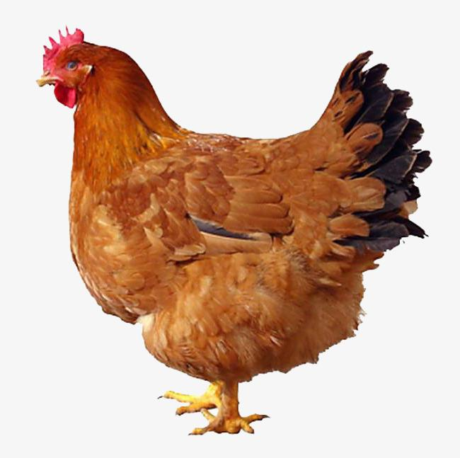

# paddleclas package

## Get started quickly

### install package

install by pypi
```bash
pip install paddleclas==2.0.0rc1
```

build own whl package and install
```bash
python3 setup.py bdist_wheel
pip3 install dist/paddleclas-x.x.x-py3-none-any.whl
```

### 1. Quick Start

* Assign `image_file='docs/images/whl/demo.jpg'`, Use inference model that Paddle provides `model_name='ResNet50'`
```python
from paddleclas import PaddleClas
clas = PaddleClas(model_name='ResNet50',use_gpu=False,use_tensorrt=False)
image_file='docs/images/whl/demo.jpg'
result=clas.predict(image_file)
print(result)
```
**Here is demo.jpg**



```
    >>> result
    [{'filename': '/Users/mac/Downloads/PaddleClas/docs/images/whl/demo.jpg', 'class_ids': [8], 'scores': [0.9796774], 'label_names': ['hen']}]
```

### 2. Definition of Parameters
* model_name(str): model's name. If not assigning `model_file`and`params_file`, you can assign this param. If using inference model based on ImageNet1k provided by Paddle, set as default='ResNet50'.
* image_file(str): image's path. Support assigning single local image, internet image and folder containing series of images.
* use_gpu(bool): Whether to use GPU or not, defalut=False。
* use_tensorrt(bool): whether to open tensorrt or not. Using it can greatly promote predict preformance, default=False.
* resize_short(int): resize the minima between height and width into resize_short(int), default=256
* resize(int): resize image into resize(int), default=224.
* normalize(bool): whether normalize image or not, default=True.
* batch_size(int): batch number, default=1.
* model_file(str): path of inference.pdmodel. If not assign this param，you need assign `model_name` for downloading.
* params_file(str): path of inference.pdiparams. If not assign this param，you need assign `model_name` for downloading.
* ir_optim(bool): whether enable IR optimization or not, default=True.
* gpu_mem(int): GPU memory usages，default=8000。
* enable_profile(bool): whether enable profile or not,default=False.
* top_k(int): Assign top_k, default=1.
* enable_mkldnn(bool): whether enable MKLDNN or not, default=False.
* cpu_num_threads(int): Assign number of cpu threads, default=10.
* label_name_path(str): Assign path of label_name_dict you use. If using your own training model, you can assign this param. If using inference model based on ImageNet1k provided by Paddle, you may not assign this param.Defaults take ImageNet1k's label name.
* pre_label_image(bool): whether prelabel or not, default=False.
* pre_label_out_idr(str): If prelabeling, the path of output.

### 3. Different Usages of Codes

* Use user-specified model, you need to assign model's path `model_file` and parameters's path`params_file`

```python
from paddleclas import PaddleClas
clas = PaddleClas(model_file='user-specified model path',
    params_file='parmas path', use_gpu=False, use_tensorrt=False)
image_file = ''
result=clas.predict(image_file)
print(result)
```

* Use inference model which PaddlePaddle provides to predict, you need to choose one of model when initializing PaddleClas to assign `model_name`. You may not assign `model_file` , and the model you chosen will be download in `BASE_INFERENCE_MODEL_DIR` ,which will be saved in folder named by `model_name`,avoiding overlay different inference model.
```python
from paddleclas import PaddleClas
clas = PaddleClas(model_name='ResNet50',use_gpu=False, use_tensorrt=False)
image_file = ''
result=clas.predict(image_file)
print(result)
```

* You can assign `image_file` as a folder path containing series of images, also can assign `top_k`.

```python
from paddleclas import PaddleClas
clas = PaddleClas(model_name='ResNet50',use_gpu=False, use_tensorrt=False,top_k=5)
image_file = '' # it can be image_file folder path which contains all of images you want to predict.
result=clas.predict(image_file)
print(result)
```

* You can assign `--pre_label_image=True`, `--pre_label_out_idr= './output_pre_label/'`.Then images will be copied into folder named by top-1 class_id.

```python
from paddleclas import PaddleClas
clas = PaddleClas(model_name='ResNet50',use_gpu=False, use_tensorrt=False,top_k=5, pre_label_image=True,pre_label_out_idr='./output_pre_label/')
image_file = '' # it can be image_file folder path which contains all of images you want to predict.
result=clas.predict(image_file)
print(result)
```

* You can assign `--label_name_path` as your own label_dict_file, format should be as(class_id<space>class_name<\n>).

```
0 tench, Tinca tinca
1 goldfish, Carassius auratus
2 great white shark, white shark, man-eater, man-eating shark, Carcharodon carcharias
......
```

* If you use inference model that Paddle provides, you do not need assign `label_name_path`. Program will take `ppcls/utils/imagenet1k_label_list.txt` as defaults. If you hope using your own training model, you can provide `label_name_path` outputing 'label_name' and scores, otherwise no 'label_name' in output information.

```python
from paddleclas import PaddleClas
clas = PaddleClas(model_file= './inference.pdmodel',params_file = './inference.pdiparams',label_name_path='./ppcls/utils/imagenet1k_label_list.txt',use_gpu=False)
image_file = '' # it can be image_file folder path which contains all of images you want to predict.
result=clas.predict(image_file)
print(result)
```

```python
from paddleclas import PaddleClas
clas = PaddleClas(model_name='ResNet50',use_gpu=False)
image_file = '' # it can be image_file folder path which contains all of images you want to predict.
result=clas.predict(image_file)
print(result)
```
